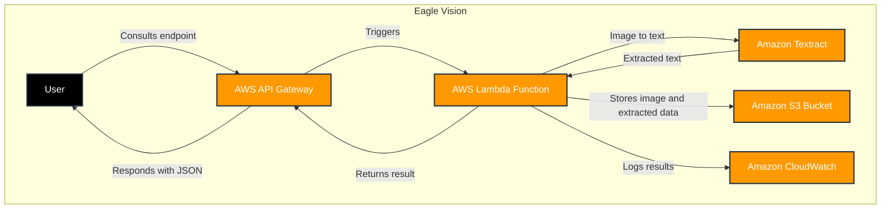

<a id="readme-top"></a>

<div align="right">
	<spam>Languages</spam>

[](README.md)
[](README-EN.md)

</div>

# 🌐 Project slideshow


<div align="center">


<details>
  <summary>Image Description</summary>
  This image contains a blue “play” icon in the center, indicating the start of a project slideshow. The background has geometric shapes in dark blue tones, with the text “Project slideshow” at the top. It guides the user to click and start the presentation.
</details>
 
</div>


---

<details>
<summary>Click here to view the table of contents</summary>
<br/>

:small_blue_diamond: [🌐 Project slideshow](#-project-slideshow)

:small_blue_diamond: [💡 About the project](#-about-the-project)

:small_blue_diamond: [📊 Project status](#-project-status)

:small_blue_diamond: [🚀 Result](#-result)

:small_blue_diamond: [🧱 File/folder structure](#-filefolder-structure)

:small_blue_diamond: [📐 System design](#-system-design)

:small_blue_diamond: [🏗️ Architecture-structure-and-interaction-flow](#%EF%B8%8F-architecture-structure-and-interaction-flow)

:small_blue_diamond: [⚔️ Technologies](#%EF%B8%8F-technologies)

:small_blue_diamond: [📜 Glossary](#-glossary)

:small_blue_diamond: [📋 References](#-references)

:small_blue_diamond: [📝 Authors](#-authors)

:small_blue_diamond: [⚖️ License](#%EF%B8%8F-license)

</details>

# 💡 About the project

⚡ Eagle Vision is a REST API in Python that receives images of electronic invoices via POST. Using the AWS API Gateway, the API stores the images in an S3 bucket and triggers an AWS Lambda function to transcribe the data with Amazon Textract. The extracted elements are organized using processing techniques and refined with a Large Language Model (LLM). The results, formatted in JSON, are also stored in an S3 bucket and sent as a response to the user. In addition, the project integrates AWS CloudWatch to monitor and log operations, ensuring scalability and efficiency in the AWS cloud.

---

# 📊 Project status

> [!NOTE]
> ☁️ In production on AWS

> [!TIP]
> 🔎 Any feedback please contact the developers

---

# 🚀 Result

> [!IMPORTANT]
> 🛰️ Project completed

> [!CAUTION]
> ⛔ After submission, the project will be excluded from aws so as not to generate costs

<div align="center">

<a href="https://youtu.be/bCDhDoPcz1o" target="_blank">
   
</a>

<details>
  <summary>Image Description</summary>
  This image contains the YouTube logo in motion, suggesting that the user can click to watch the project's video. The logo is centered, and the GIF creates a sense of interactivity. By clicking on the image, the user will be redirected to the project's video on YouTube.
</details>

</div>

---

# 🧱 File/folder structure

<div align="left">

```
/Eagle-Vision
|
├── /docs                                           # Folder for project documentation.
|   └── passo-a-passo-aws-projeto.pdf               # PDF file with instructions for setting up the AWS environment.
|
├── /src                                            # Main directory for source code.
|   ├── /Lambda-Eagle-Vision-API                    # Folder containing the Lambda code for the API.
|   |   ├── /controller                             # Folder for controllers.
|   |   |    └── lambda_controller.py               # Controller file for the Lambda function.
|   |   |
|   |   ├── /model                                  # Folder for data models.
|   |   |   └── jsondata_model.py                   # Data model file for JSON manipulation.
|   |   |
|   |   ├── /service                                # Folder for services.
|   |   |   ├── decoder_service.py                  # Service for decoding data, file manipulation.
|   |   |   ├── preprocessing_service.py            # Service for image pre-processing.
|   |   |   ├── refinement_service.py               # Service for processing and refining extracted data.
|   |   |   ├── s3_service.py                       # Service for integration and manipulation of files in S3.
|   |   |   └── textract_service.py                 # Service for text extraction using Amazon Textract.
|   |   |
|   |   └── lambda_function.py                      # Main Lambda function.
|   |
|   ├── /Eagle-Vision-Swagger                       # Folder containing Swagger documentation for the API.
|   |   ├── /assets                                 # Static resources like images and CSS files for documentation.
|   |   |   ├── /css                                # CSS files for styling Swagger documentation.
|   |   |   |   ├── index.css                       # Main CSS file.
|   |   |   |   └── swagger-ui.css                  # CSS for the Swagger UI interface.
|   |   |   └── /images                             # Images used in the documentation.
|   |   |       ├── aws.gif                         # Animated image representing AWS.
|   |   |       ├── favicon-16x16.png               # 16x16 pixel icon.
|   |   |       └── favicon-32x32.png               # 32x32 pixel icon.
|   |   |
|   |   ├── /controller                             # Controller definitions in Swagger.
|   |   |   └── /js                                 # JavaScript files for Swagger initialization.
|   |   |       ├── swagger-initializer.js          # Swagger initializer.
|   |   |       ├── swagger-ui-bundle.js            # JavaScript bundle for Swagger UI.
|   |   |       └── swagger-ui-standalone-preset.js # Standalone configurations for Swagger UI.
|   |   |
|   |   ├── /model                                  # Data model definitions in Swagger.
|   |   |   └── /openapi                            # OpenAPI specification files.
|   |   |       ├── openapi.json                    # JSON file with the API specification.
|   |   |       └── openapi.txt                     # Text file with additional notes for the OpenAPI specification.
|   |   |
|   |   └── index.html                              # Homepage of the Swagger documentation.
|
├── /assets                                         # Folder containing media files and other resources used in the application.
│   └── /dataset                                    # Subfolder specifically for storing the dataset used in the project.
|   |   └── /NFs.zip                                # Compressed file with images of invoices.
|   |
│   └── /imagens                                    # Subfolder specifically for storing images used in the project.
|   |   └── /readme                                 # Subfolder containing images used specifically in the README in both Portuguese and English.
|   |       ├── aws.gif                             # Image file of the AWS architecture presentation in Portuguese.
|   |       ├── aws-en.gif                          # Image file of the AWS architecture presentation in English.
|   |       ├── compassuol.jpg                      # Image file of CompassUOL.
|   |       ├── trello.gif                          # Image file of the Trello board.
|   |       ├── youtube-logo.gif                    # Image file of the YouTube logo.
|   |       ├── youtube-logo-en.gif                 # Image file of the YouTube logo in English.
|   |       ├── sistema.svg                         # Image file of the system design diagram in Portuguese.
|   |       ├── sistema-en.svg                      # Image file of the system design diagram in English.
|   |       ├── logo-projeto-en.gif                 # Image file of the project presentation in English.
│   |       └── logo-projeto.gif                    # Image file of the project presentation in Portuguese.
|   |
│   └── /passo-a-passo-aws                          # Subfolder specifically for storing files mentioned in the AWS setup documentation.
|       ├── /v1                                     # Folder for version 1 of the files.
|       |   ├── data.json                           # JSON file for example response to the user.
|       |   ├── Eagle-Vision-API.zip                # Zip file of the Eagle Vision API v2.
|       |   ├── Lambda-Eagle-Vision-API.zip         # Zip file of the Lambda Eagle Vision API v1.
|       |   ├── NFCEmodelo.jpg                      # Image file of NFCEmodelo.
|       |   └── nota-fiscal.jpg                     # Image file for testing the project taken from the dataset.
|       |
|       └── /v2                                     # Folder for version 2 of the files.
|           ├── /lambda                             # Subfolder for Lambda code.
|           |    └── lambda-ealge-vision-api.zip    # Zip file of the final version of the Lambda Eagle Vision API.
|           └── /layer                              # Subfolder for libraries.
|               └── Lambda Libraries.zip            # Zip file of the libraries used in the Lambda.
|
├── README-EN.md                                    # File for project documentation in English.
├── README.md                                       # File for project documentation in Portuguese.
├── CODE_OF_CONDUCT.md                              # Document establishing the code of conduct for the project community.
├── LICENSE                                         # Document describing the terms of the license under which the project is distributed.
├── SECURITY.md                                     # Document file covering the project's security practices and policies.
└── .gitignore                                      # File to indicate to Git which files/types of files should not be tracked.
```

</div>

---

# 📐 System design



> [!warning]
> 🚧 GitHub mobile does not support mermaid, below is a diagram of the system design



<div align="left">

<details>
  <summary>Image Description</summary>
  This flowchart describes a system based on AWS:
  
  - The **User** initiates the interaction by querying an endpoint.
  - The request goes through the **AWS API Gateway**, which responds with JSON and triggers an **AWS Lambda Function**.
  - The Lambda Function makes calls to three services:
    - **Amazon Textract**: Converts image to text.
    - **Amazon S3 Bucket**: Stores the images and extracted data.
    - **Amazon CloudWatch**: Records logs of the results.
    
  The flow is represented by arrows connecting the main components, the user is arranged in a black box and the others are arranged in orange boxes, with the background in dark gray and the connections in light gray.
</details>

</div>

---

# 🏗️ Architecture structure and interaction flow

**1. Architecture**

<div align="center">
	


<details>
  <summary>Image Description</summary>
  The image shows a blue “play” icon in the center, suggesting the start of a presentation. In the background is an illustration of a digital cloud with electronic circuits in shades of blue, representing cloud computing architecture. The text “Serverless architecture” is positioned at the top, highlighting the theme of the presentation. In the bottom right-hand corner is the Amazon Web Services (AWS) logo.
</details>

</div>

**2. Data Flow**

- Invoice reception:
- - The user uploads the invoice via the `(POST http://<URL>/api/v1/invoice)` endpoint.
- - There is no body content in the request. The following is an example of a curl command:

```shell
  curl --location --request POST 'http://<URL>/api/v1/invoice' --form 'file=@"<Nome do arquivo>"'
```

- Integration with Lambda:
- - The API Gateway invokes the Lambda function that processes the request.
- Storage in S3:
- - The Lambda function stores the image in the S3 bucket.
- Processing by Textract:
- - The Lambda function uses Textract to extract data from the invoice.
- Processing and refinement with LLM:
- - The Lambda function sends the extracted data to the LLM model, where it is processed and refined to identify specific elements. The model organizes and formats the information, ensuring that the data is structured accurately for use.
- Payment Classification:
- - The bill is moved to the corresponding folder in S3 based on the form of payment, cash/pix for `cash` and other forms of payment for `other`.
- User response:
- - The API returns the structured invoice data to the user in JSON format via the API Gateway.
- - For unidentified fields, the value is `None`.

```json
{
  "nome_emissor": "<nome-fornecedor>",
  "CNPJ_emissor": "00.000.000/0000-00",
  "endereco_emissor": "<endereco-fornecedor>",
  "CNPJ_CPF_consumidor": "000.000.000-00",
  "data_emissao": "00/00/0000",
  "numero_nota_fiscal": "123456",
  "serie_nota_fiscal": "123",
  "valor_total": "0000.00",
  "forma_pgto": "<dinheiropix/outros>"
}
```

---

# ⚔️ Technologies

The following tools were used to develop this project:

<div align="center">

|                                                                                                        Tool                                                                                                         |                                              Utilized                                              |
| :-----------------------------------------------------------------------------------------------------------------------------------------------------------------------------------------------------------------: | :------------------------------------------------------------------------------------------------: |
|     [Windows System](https://www.microsoft.com/en-us/windows)      |                                          Operating system                                          |
| [Visual Studio Code](https://code.visualstudio.com/) |                                            Code editor                                             |
|                  [Trello](https://trello.com/)                   |                                     General task organization                                      |
|              [Postman](https://www.postman.com/)              |                                            API testing                                             |
|    [AWS](https://aws.amazon.com/en/)    |                                    Project hosted on AWS cloud                                     |
|                                 [GitHub](https://github.com/)                                  |                                  Code repository hosting platform                                  |
|                               [Discord](https://discord.com/)                               |                                     Platform used for meetings                                     |
|                                       [Git](https://git-scm.com/)                                       |                                        Version control tool                                        |
|    [ amazoncloudwatch](https://aws.amazon.com/pt/cloudwatch/)    |                Collects and records logs, metrics and real-time project event data                 |
|                       [Amazon S3](https://aws.amazon.com/en/s3/)                        |                               Storage for images and extracted data                                |
|  [Amazon API Gateway](https://aws.amazon.com/en/api-gateway/)  | Exposes the API endpoint and sends the user's request to the Lambda function and receives the json |
|               [Amazon Lambda](https://aws.amazon.com/en/pm/lambda/)               |                        The Lambda function executes the API logic in python                        |
|                   [Canva](https://www.canva.com/)                   |                                           Project design                                           |
|                                                                                                         ...                                                                                                         |                                                ...                                                 |

</div>

---

# 📜 Glossary

<div align="center">

Certain terms are used throughout the Eagle Vision project with consistent meanings or conventions, below are some of them.

| Term                   | Description                                                                        |
| ---------------------- | ---------------------------------------------------------------------------------- |
| **AWS**                | Amazon Web Services.                                                               |
| **API**                | Application Programming Interface.                                                 |
| **Amazon S3**          | Amazon Simple Storage Service.                                                     |
| **Amazon Lambda**      | AWS serverless computing service that runs code in response to events.             |
| **Amazon API Gateway** | Service that enables the creation, publication, maintenance, and security of APIs. |
| **Amazon CloudWatch**  | Monitoring service for AWS resources that collects and tracks metrics and logs.    |
| **Amazon Textract**    | Service for automatic extraction of text and data from scanned documents.          |
| **JSON**               | JavaScript Object Notation.                                                        |

</div>

---

# 📋 References

- [Tips for Making your GitHub Profile Page Accessible](https://github.blog/2023-10-26-5-tips-for-making-your-github-profile-page-accessible)
- [Como escrever um README incrível no seu Github](https://www.alura.com.br/artigos/escrever-bom-readme)
- [O que é Commit e como usar Commits Semânticos](https://blog.geekhunter.com.br/o-que-e-commit-e-como-usar-commits-semanticos/)
- [Padrões de commits](https://github.com/iuricode/padroes-de-commits)
- [Devicon](https://devicon.dev/)
- [Criando diagramas](https://docs.github.com/pt/get-started/writing-on-github/working-with-advanced-formatting/creating-diagrams)
- [Sintaxe básica de gravação e formatação no GitHub](https://docs.github.com/pt/get-started/writing-on-github/getting-started-with-writing-and-formatting-on-github/basic-writing-and-formatting-syntax)
- [Como criar diagramas animados de arquiteturas no Draw io](https://www.youtube.com/watch?v=ivZSCxFhTCI)
- [Criando Diagrama de Arquitetura Cloud e AWS do Zero](https://www.youtube.com/watch?v=rI9OkqrqOJw)
- [draw.io-online](https://app.diagrams.net/)
- [drawio-desktop](https://github.com/jgraph/drawio-desktop)
- [Ícones de arquitetura da AWS](https://aws.amazon.com/pt/architecture/icons/)
- [How to draw a Network traffic diagram animated](https://www.youtube.com/watch?v=x9gSsPEMaQM)
- [Sem servidor na AWS](https://aws.amazon.com/pt/serverless/)
- [Introdução ao Padrão MVC](https://www.devmedia.com.br/introducao-ao-padrao-mvc/29308)
- [Hospedando um site RAPIDAMENTE na nuvem da AWS S3 (muito simples e de graça)](https://www.youtube.com/watch?v=QWGg1I1wido&t=3s)
- [Devicon](https://devicon.dev/)
- [Simpleicons](https://simpleicons.org/)
- [Mermaid](https://mermaid.live/)
- [Mermaid-github](https://github.com/mermaid-js/mermaid)
- [Readme-typing-svg](https://github.com/DenverCoder1/readme-typing-svg)
- [Analisando faturas e recibos com o Amazon Textract](https://docs.aws.amazon.com/pt_br/textract/latest/dg/analyzing-document-expense.html)
- [Analisando faturas e recibos](https://docs.aws.amazon.com/pt_br/textract/latest/dg/invoices-receipts.html)
- [Amazon Textract - Building a Receipt Processing Solution](https://github.com/raminetinati/aws-demo-textract-receipts)
- [Finetune LLM to convert a receipt image to json or xml](https://mychen76.medium.com/finetune-llm-to-convert-a-receipt-image-to-json-or-xml-3f9a6237e991)
- [Build a receipt and invoice processing pipeline with Amazon Textract](https://aws.amazon.com/pt/blogs/machine-learning/build-a-receipt-and-invoice-processing-pipeline-with-amazon-textract/)
- [Modelo sem cloud, Sparrow Data processing with ML, LLM and Vision LLM](https://github.com/katanaml/sparrow)

---

# 📝 Authors

<div align="center">
  <table>
    <tr>
      <td>
        <div align="center">
          <a href="https://github.com/BakMarino" target="_blank">
            
          </a><br>
	 <a href="https://github.com/BakMarino" target="_blank">
            
          </a>
	  <a href="https://www.linkedin.com/in/amanda-marino-276130247/" target="_blank">
            
          </a><br>
          <details>
            <summary>Image Description</summary>
            This image shows Amanda Marino's profile picture on GitHub. The github badge and another linkedin badge, and by clicking on the image or the badges, you will be directed to the profile.
          </details>
        </div>
      </td>
      <td>
        <div align="center">
          <a href="https://github.com/GsteXD" target="_blank">
            
          </a><br>
         <a href="https://github.com/GsteXD" target="_blank">
            
          </a>
	  <a href="https://www.linkedin.com/in/gustavo-seiji-tsuru-endo-a55b60204/" target="_blank">
            
          </a><br>
          <details>
            <summary>Image Description</summary>
            This image shows Gustavo Tsuru's profile picture on GitHub. The github badge and another linkedin badge, and by clicking on the image or the badges, you will be directed to the profile.
          </details>
        </div>
      </td>
      <td>
        <div align="center">
          <a href="https://github.com/NeemiasBorges" target="_blank">
            
          </a><br>
	  <a href="https://github.com/NeemiasBorges" target="_blank">
            
          </a>
	  <a href="https://www.linkedin.com/in/neemias-borges/" target="_blank">
            
          </a><br>
          <details>
            <summary>Image Description</summary>
            This image shows Neemias Borges' profile picture on GitHub. The github badge and another linkedin badge, and by clicking on the image or the badges, you will be directed to the profile.
          </details>
        </div>
      </td>
      <td>
        <div align="center">
          <a href="https://github.com/RamonCintas" target="_blank">
            
          </a><br>
	  <a href="https://github.com/RamonCintas" target="_blank">
            
          </a>
	  <a href="https://www.linkedin.com/in/ramon-cg/" target="_blank">
            
          </a><br>
          <details>
            <summary>Image Description</summary>
            This image shows Ramon Gomes' profile picture on GitHub. The github badge and another linkedin badge, and by clicking on the image or the badges, you will be directed to the profile.
          </details>
        </div>
      </td>
    </tr>
  </table>
</div>

---

# ⚖️ License

<div align="center">

Copyright [© COMPASS.UOL TECNOLOGIA LTDA - 1996 - 2024 - Todos os direitos reservados](https://compass.uol/pt/home/).<br/><br/>


</div>

<p align="right">(<a href="#readme-top">Back to top</a>)</p>

<div align="center">


<details>
  <summary>Image Description</summary>
  The image shows a GIF illustrating that data is protected.
</details>

</div>
