<a id="readme-top"></a>

<div align="right">
	<spam>Idiomas</spam>

[](README.md)
[](README-EN.md)

</div>

# 🌐 Apresentação de slides do projeto


<div align="center">
	


<details>
  <summary>Descrição da Imagem</summary>
  Esta imagem contém um ícone de "play" azul no centro, indicando o início de uma apresentação de slides do projeto. O fundo possui formas geométricas em tons de azul escuro, com o texto "Apresentação de slides do projeto" no topo. Serve para guiar o usuário a clicar e iniciar a apresentação.
</details>

</div>

 
---

<details>
<summary>Clique aqui para visualizar o índice</summary>
<br/>

:small_blue_diamond: [🌐 Apresentação de slides do projeto](#-apresenta%C3%A7%C3%A3o-de-slides-do-projeto)

:small_blue_diamond: [💡 Sobre o projeto](#-sobre-o-projeto)

:small_blue_diamond: [📊Status do projeto](#-status-do-projeto)

:small_blue_diamond: [🚀 Resultado](#-resultado)

:small_blue_diamond: [🧱 Estrutura de arquivos/pastas](#-estrutura-de-arquivospastas)

:small_blue_diamond: [📐 Desenho do sistema](#-desenho-do-sistema)

:small_blue_diamond: [🏗️ Estrutura da Arquitetura e fluxo de interação](#%EF%B8%8F-estrutura-da-arquitetura-e-fluxo-de-intera%C3%A7%C3%A3o)

:small_blue_diamond: [⚔️ Tecnologias](#%EF%B8%8F-tecnologias)

:small_blue_diamond: [📜 Glossário](#-glossário)

:small_blue_diamond: [📋 Referências](#-refer%C3%AAncias)

:small_blue_diamond: [📝 Autores](#-autores)

:small_blue_diamond: [⚖️ Licença](#%EF%B8%8F-licen%C3%A7a)

</details>

# 💡 Sobre o projeto

⚡ O Eagle Vision é uma API REST em Python que recebe imagens de notas fiscais eletrônicas via POST. Utilizando o API Gateway da AWS, a API armazena as imagens em um bucket S3 e aciona uma função AWS Lambda para transcrever os dados com o Amazon Textract. Os elementos extraídos são organizados usando técnicas de processamento e refinados com uma Large Language Model (LLM). Os resultados, formatados em JSON, também são armazenados em um bucket S3 e enviados como resposta para o usuário. Além disso, o projeto integra AWS CloudWatch para monitorar e registrar logs das operações, garantindo escalabilidade e eficiência na nuvem AWS.

---

# 📊 Status do projeto

> [!NOTE]
> ☁️ Em produção na AWS

> [!TIP]
> 🔎 Qualquer feedback entrar em contato com os desenvolvedores

---

# 🚀 Resultado

> [!IMPORTANT]
> 🛰️ Projeto concluído

> [!CAUTION]
> ⛔ Após a apresentação o projeto será excluído da aws para não gerar custo

<div align="center">

<a href="https://youtu.be/bCDhDoPcz1o" target="_blank" aria-label="Acessar o vídeo do projeto no YouTube">
 </a>

<details>
  <summary>Descrição da Imagem</summary>
  Esta imagem contém o logotipo do YouTube em movimento, sugerindo que o usuário pode clicar para assistir ao vídeo do projeto. O logotipo está centralizado, e o GIF cria uma sensação de interatividade. Ao clicar na imagem, o usuário será redirecionado para o vídeo do projeto no YouTube.
</details>

</div>

---

# 🧱 Estrutura de arquivos/pastas

<div align="left">
	
```
/Eagle-Vision
|
├── /docs                                           # Pasta para documentação do projeto.
|   └── passo-a-passo-aws-projeto.pdf               # Arquivo PDF com as instruções para configurar o ambiente AWS.
|
├── /src                                            # Diretório principal para o código-fonte.
|   ├── /Lambda-Eagle-Vision-API                    # Pasta com o código do Lambda para a API.
|   |   ├── /controller                             # Pasta para controladores.
|   |   |    └── lambda_controller.py               # Arquivo controlador da função Lambda.
|   |   |
|   |   ├── /model                                  # Pasta para modelos de dados.
|   |   |   └── jsondata_model.py                   # Arquivo de modelo de dados para manipulação de JSON.
|   |   |
|   |   ├── /service                                # Pasta para serviços.
|   |   |   ├── decoder_service.py                  # Serviço para decodificação de dados, manipulação de arquivos.
|   |   |   ├── preprocessing_service.py            # Serviço para pré-processamento da imagem.
|   |   |   ├── refinement_service.py               # Serviço de processamento e refinamento dos dados extraídos.
|   |   |   ├── s3_service.py                       # Serviço para integração e manipulação de arquivos no S3.
|   |   |   └── textract_service.py                 # Serviço para extração de texto usando Amazon Textract.
|   |   |
|   |   └── lambda_function.py                      # Função principal Lambda.
|   |
|   ├── /Eagle-Vision-Swagger                       # Pasta com a documentação Swagger da API.
|   |   ├── /assets                                 # Recursos estáticos, como imagens e arquivos CSS, para a documentação.
|   |   |   ├── /css                                # Arquivos CSS para estilizar a documentação Swagger.
|   |   |   |   ├── index.css                       # Arquivo CSS principal.
|   |   |   |   └── swagger-ui.css                  # CSS para a interface do Swagger UI.
|   |   |   └── /images                             # Imagens utilizadas na documentação.
|   |   |       ├── aws.gif                         # Imagem animada representativa da AWS.
|   |   |       ├── favicon-16x16.png               # Ícone de 16x16 pixels.
|   |   |       └── favicon-32x32.png               # Ícone de 32x32 pixels.
|   |   |
|   |   ├── /controller                             # Definições de controladores no Swagger.
|   |   |   └── /js                                 # Arquivos JavaScript para inicialização do Swagger.
|   |   |       ├── swagger-initializer.js          # Inicializador do Swagger.
|   |   |       ├── swagger-ui-bundle.js            # Bundle de arquivos JavaScript para o Swagger UI.
|   |   |       └── swagger-ui-standalone-preset.js # Configurações autônomas do Swagger UI.
|   |   |
|   |   ├── /model                                  # Definições de modelos de dados no Swagger.
|   |   |   └── /openapi                            # Arquivos de especificação OpenAPI.
|   |   |       ├── openapi.json                    # Arquivo JSON com a especificação da API.
|   |   |       └── openapi.txt                     # Arquivo de texto com notas adicionais para a especificação OpenAPI.
|   |   |
|   |   └── index.html                              # Página inicial da documentação Swagger.
|
├── /assets                                         # Pasta que contém arquivos de mídia e outros recursos usados na aplicação.
│   └── /dataset                                    # Subpasta específica para armazenar o conjunto de dados utilizadas no projeto.
|   |   └── /NFs.zip                                # Arquivo compactado com imagens de notas fiscais.
|   |
│   └── /imagens                                    # Subpasta específica para armazenar imagens utilizadas no projeto.
|   |   └── /readme                                 # Subpasta que contém imagens utilizadas especificamente no README versão português e inglês.
|   |       ├── aws.gif                             # Arquivo de imagem da apresentação da arquitetura aws em português.
|   |       ├── aws-en.gif                          # Arquivo de imagem da apresentação da arquitetura aws em inglês.
|   |       ├── compassuol.jpg                      # Arquivo de imagem da CompassUOL.
|   |       ├── trello.gif                          # Arquivo de imagem do quadro do trello.
|   |       ├── youtube-logo.gif                    # Arquivo de imagem da logo do youtube.
|   |       ├── youtube-logo-en.gif                 # Arquivo de imagem da logo do youtube em inglês.
|   |       ├── sistema.svg                         # Arquivo de imagem do diagrama de desenho do sistema em português.
|   |       ├── sistema-en.svg                      # Arquivo de imagem do diagrama de desenho do sistema em inglês.
|   |       ├── logo-projeto-en.gif                 # Arquivo de imagem da apresentação do projeto em inglês.
│   |       └── logo-projeto.gif                    # Arquivo de imagem da apresentação do projeto em português.
|   |
│   └── /passo-a-passo-aws                          # Subpasta específica para armazenar os arquivos citados na documentação de configuração da aws.
|       ├── /v1                                     # Pasta para a versão 1 dos arquivos.
|       |   ├── data.json                           # Arquivo de json para exemplo de resposta ao usuário.
|       |   ├── Eagle-Vision-API.zip                # Arquivo zip da API Eagle Vision v2.
|       |   ├── Lambda-Eagle-Vision-API.zip         # Arquivo zip da API Lambda Eagle Vision v1.
|       |   ├── NFCEmodelo.jpg                      # Arquivo de imagem NFCEmodelo.
|       |   └── nota-fiscal.jpg                     # Arquivo de imagem para teste do projeto tirada do dataset.
|       |
|       └── /v2                                     # Pasta para a versão 2 dos arquivos.
|           ├── /lambda                             # Subpasta para código Lambda.
|           |    └── lambda-ealge-vision-api.zip    # Arquivo zip da API Lambda Eagle Vision versão final.
|           └── /layer                              # Subpasta para biblioteca.
|               └── Lambda Libraries.zip            # Arquivo zip das bibliotecas usadas no Lambda.
|
├── README-EN.md                                    # Arquivo para documentação do projeto em inglês.
├── README.md                                       # Arquivo para documentação do projeto em português.
├── CODE_OF_CONDUCT.md                              # Arquivo de documento que estabelece as diretrizes de conduta para a comunidade do projeto.
├── LICENSE                                         # Arquivo de documento que descreve os termos da licença sob a qual o projeto é distribuído.
├── SECURITY.md                                     # Arquivo de documento que aborda as práticas e políticas de segurança do projeto.
└── .gitignore                                      # Arquivo para indicar ao Git quais arquivos/tipos de arquivos não devem ser rastreados.

````

</div>

---

# 📐 Desenho do sistema

```mermaid

graph TD;
    %% Projeto Eagle Vision
    subgraph Eagle Vision

        %% Interação do Usuário
        U[Usuário] -->|Consulta endpoint| APIGateway[AWS API Gateway]

        %% API Gateway Chamando Lambda
        APIGateway -->|Aciona| Lambda[AWS Lambda Function]

        %% Lambda Processa a Imagem e Invoca Textract
        Lambda -->|Imagem para texto| Textract[Amazon Textract]
        Lambda -->|Armazena imagem e dados extraídos| S3[Amazon S3 Bucket]

        %% Textract Analisa e Retorna os Dados
        Textract -->|Texto extraído| Lambda

        %% Lambda Grava Logs e Retorna Resposta ao Usuário
        Lambda -->|Grava logs dos resultados| CloudWatch[Amazon CloudWatch]
        Lambda -->|Retorna resultado| APIGateway
        APIGateway -->|Responde com JSON| U

    end

    %% Estilos de classe
    classDef aws fill:#FF9900,stroke:#232F3E,stroke-width:2px,color:white;
    classDef lambda fill:#FF9900,stroke:#232F3E,stroke-width:2px,color:white;
    classDef user fill:#000000,stroke:#232F3E,stroke-width:2px,color:white;

    class U user;
    class APIGateway,Textract,S3,CloudWatch aws;
    class Lambda lambda;

````

> [!warning]
> 🚧 GitHub mobile não tem suporte para mermaid, segue abaixo o diagrama do desenho do sistema



<div align="left">

<details>
  <summary>Descrição da Imagem</summary>
  Este fluxograma descreve um sistema baseado na AWS:
  
  - O **Usuário** inicia a interação ao consultar um endpoint.
  - A solicitação passa pelo **AWS API Gateway**, que responde com JSON e aciona uma **AWS Lambda Function**.
  - A **Lambda Function** faz chamadas para três serviços:
    - **Amazon Textract**: Converte imagem para texto.
    - **Amazon S3 Bucket**: Armazena as imagens e os dados extraídos.
    - **Amazon CloudWatch**: Grava logs dos resultados.
    
  O fluxo é representado por setas conectando os componentes principais, o usuário está disposto em uma caixa preta e os outros estão dispostos em caixas laranja, com o fundo em cinza escuro e as conexões em cinza claro.
</details>

</div>

---

# 🏗️ Estrutura da Arquitetura e fluxo de interação

**1. Arquitetura**

<div align="center">
	


<details>
  <summary>Descrição da Imagem</summary>
  A imagem exibe um ícone de "play" azul no centro, sugerindo o início de uma apresentação. Ao fundo, há uma ilustração de uma nuvem digital com circuitos eletrônicos em tons de azul, representando uma arquitetura de computação em nuvem. O texto "Arquitetura sem servidor" está posicionado na parte superior, destacando o tema da apresentação. No canto inferior direito, há o logo da Amazon Web Services (AWS).
</details>

</div>

**2. Fluxo de Dados**

- Recepção da Nota Fiscal:
- - O usuário faz upload da nota fiscal através do endpoint `(POST http://<URL>/api/v1/invoice)`.
- - Não há conteúdo em body na requisição. Segue o exemplo de comando curl:

```shell
  curl --location --request POST 'http://<URL>/api/v1/invoice' --form 'file=@"<Nome do arquivo>"'
```

- Integração com Lambda:
- - O API Gateway invoca a função Lambda que processa a requisição.
- Armazenamento em S3:
- - A função Lambda armazena a imagem no bucket S3.
- Processamento pelo Textract:
- - A função Lambda usa o Textract para extrair dados da nota fiscal.
- Processamento e Refinamento com LLM:
- - A função Lambda envia os dados extraídos para o modelo LLM, onde eles são processados e refinados para identificar elementos específicos. O modelo organiza e formata as informações, garantindo que os dados estejam estruturados de maneira precisa para o uso.
- Classificação de Pagamentos:
- - A nota é movida para a pasta correspondente no S3 com base na forma de pagamento, dinheiro/pix para `dinheiro` e outras formas de pagamento para `outros`.
- Resposta ao Usuário:
- - A API retorna os dados estruturados da nota fiscal ao usuário em formato JSON via API Gateway.
- - Para campos não identificados o valor é `None`.

```json
{
  "nome_emissor": "<nome-fornecedor>",
  "CNPJ_emissor": "00.000.000/0000-00",
  "endereco_emissor": "<endereco-fornecedor>",
  "CNPJ_CPF_consumidor": "000.000.000-00",
  "data_emissao": "00/00/0000",
  "numero_nota_fiscal": "123456",
  "serie_nota_fiscal": "123",
  "valor_total": "0000.00",
  "forma_pgto": "<dinheiropix/outros>"
}
```

---

# ⚔️ Tecnologias

As seguintes ferramentas foram utilizadas para desenvolver esse projeto:

<div align="center">

|                                                                                                     Ferramenta                                                                                                      |                                          Utilizada                                           |
| :-----------------------------------------------------------------------------------------------------------------------------------------------------------------------------------------------------------------: | :------------------------------------------------------------------------------------------: |
|     [Sistema Windows](https://www.microsoft.com/pt-br/windows)     |                                     Sistema operacional                                      |
| [Visual Studio Code](https://code.visualstudio.com/) |                                       Editor de código                                       |
|                  [Trello](https://trello.com/)                   |                                 Organização geral de tarefas                                 |
|              [Postman](https://www.postman.com/)              |                                         Teste de API                                         |
|    [AWS](https://aws.amazon.com/pt/)    |                                Projeto hospedado na cloud AWS                                |
|                                 [ GitHub](https://github.com/)                                 |                      Plataforma de hospedagem de repositórios de código                      |
|                              [ Discord](https://discord.com/)                               |                              Plataforma Utilizada para reuniões                              |
|                                      [ Git](https://git-scm.com/)                                       |                            Ferramenta de versionamento de código                             |
|    [ amazoncloudwatch](https://aws.amazon.com/pt/cloudwatch/)    |         Coleta e registra logs, métricas e dados de eventos em tempo real do projeto         |
|                       [ Amazon S3](https://aws.amazon.com/pt/s3/)                       |                          Armazenamento de imagens e dados extraídos                          |
| [ Amazon API Gateway](https://aws.amazon.com/pt/api-gateway/)  | Expõe o endpoint da API e envia a requisição do usuário para a função Lambda e recebe o json |
|              [ Amazon Lambda](https://aws.amazon.com/pt/pm/lambda/)               |                      A função Lambda executa a lógica da API em python                       |
|                  [ Canva](https://www.canva.com/)                  |                                      Design do projeto                                       |
|                                                                                                         ...                                                                                                         |                                             ...                                              |

</div>

---

# 📜 Glossário

<div align="center">

Certos termos são usados ao longo do projeto Eagle Vision com significados consistentes ou convenções, segue abaixo alguns deles.

| Termo                  | Descrição                                                                            |
| ---------------------- | ------------------------------------------------------------------------------------ |
| **AWS**                | Serviços Web da Amazon.                                                              |
| **API**                | Interface de Programação de Aplicações.                                              |
| **Amazon S3**          | Serviço de Armazenamento Simples da Amazon.                                          |
| **Amazon Lambda**      | Serviço de computação sem servidor da AWS que executa código em resposta a eventos.  |
| **Amazon API Gateway** | Serviço que permite a criação, publicação, manutenção e segurança de APIs.           |
| **Amazon CloudWatch**  | Serviço de monitoramento para recursos da AWS que coleta e rastreia métricas e logs. |
| **Amazon Textract**    | Serviço de extração automática de texto e dados de documentos escaneados.            |
| **JSON**               | Notação de Objetos JavaScript.                                                       |

</div>

---

# 📋 Referências

- [Tips for Making your GitHub Profile Page Accessible](https://github.blog/2023-10-26-5-tips-for-making-your-github-profile-page-accessible)
- [Como escrever um README incrível no seu Github](https://www.alura.com.br/artigos/escrever-bom-readme)
- [O que é Commit e como usar Commits Semânticos](https://blog.geekhunter.com.br/o-que-e-commit-e-como-usar-commits-semanticos/)
- [Padrões de commits](https://github.com/iuricode/padroes-de-commits)
- [Devicon](https://devicon.dev/)
- [Criando diagramas](https://docs.github.com/pt/get-started/writing-on-github/working-with-advanced-formatting/creating-diagrams)
- [Sintaxe básica de gravação e formatação no GitHub](https://docs.github.com/pt/get-started/writing-on-github/getting-started-with-writing-and-formatting-on-github/basic-writing-and-formatting-syntax)
- [Como criar diagramas animados de arquiteturas no Draw io](https://www.youtube.com/watch?v=ivZSCxFhTCI)
- [Criando Diagrama de Arquitetura Cloud e AWS do Zero](https://www.youtube.com/watch?v=rI9OkqrqOJw)
- [draw.io-online](https://app.diagrams.net/)
- [drawio-desktop](https://github.com/jgraph/drawio-desktop)
- [Ícones de arquitetura da AWS](https://aws.amazon.com/pt/architecture/icons/)
- [How to draw a Network traffic diagram animated](https://www.youtube.com/watch?v=x9gSsPEMaQM)
- [Sem servidor na AWS](https://aws.amazon.com/pt/serverless/)
- [Introdução ao Padrão MVC](https://www.devmedia.com.br/introducao-ao-padrao-mvc/29308)
- [Hospedando um site RAPIDAMENTE na nuvem da AWS S3 (muito simples e de graça)](https://www.youtube.com/watch?v=QWGg1I1wido&t=3s)
- [Devicon](https://devicon.dev/)
- [Simpleicons](https://simpleicons.org/)
- [Mermaid](https://mermaid.live/)
- [Mermaid-github](https://github.com/mermaid-js/mermaid)
- [Readme-typing-svg](https://github.com/DenverCoder1/readme-typing-svg)
- [Analisando faturas e recibos com o Amazon Textract](https://docs.aws.amazon.com/pt_br/textract/latest/dg/analyzing-document-expense.html)
- [Analisando faturas e recibos](https://docs.aws.amazon.com/pt_br/textract/latest/dg/invoices-receipts.html)
- [Amazon Textract - Building a Receipt Processing Solution](https://github.com/raminetinati/aws-demo-textract-receipts)
- [Finetune LLM to convert a receipt image to json or xml](https://mychen76.medium.com/finetune-llm-to-convert-a-receipt-image-to-json-or-xml-3f9a6237e991)
- [Build a receipt and invoice processing pipeline with Amazon Textract](https://aws.amazon.com/pt/blogs/machine-learning/build-a-receipt-and-invoice-processing-pipeline-with-amazon-textract/)
- [Modelo sem cloud, Sparrow Data processing with ML, LLM and Vision LLM](https://github.com/katanaml/sparrow)

---

# 📝 Autores

<div align="center">
  <table>
    <tr>
      <td>
        <div align="center">
          <a href="https://github.com/BakMarino" target="_blank">
            
          </a><br>
	  <a href="https://github.com/BakMarino" target="_blank">
            
          </a>
	  <a href="https://www.linkedin.com/in/amanda-marino-276130247/" target="_blank">
            
          </a><br>
          <details>
            <summary>Descrição da Imagem</summary>
            Esta imagem mostra a foto de perfil de Amanda Marino no GitHub. O badge do github e outro badge do linkedin, e ao clicar na imagem ou nos badges, você será direcionado ao perfil.
          </details>
        </div>
      </td>
      <td>
        <div align="center">
          <a href="https://github.com/GsteXD" target="_blank">
            
          </a><br>
	 <a href="https://github.com/GsteXD" target="_blank">
            
          </a>
	 <a href="https://www.linkedin.com/in/gustavo-seiji-tsuru-endo-a55b60204/" target="_blank">
            
          </a><br>
          <details>
            <summary>Descrição da Imagem</summary>
            Esta imagem mostra a foto de perfil de Gustavo Tsuru no GitHub. O badge do github e outro badge do linkedin, e ao clicar na imagem ou nos badges, você será direcionado ao perfil.
          </details>
        </div>
      </td>
      <td>
        <div align="center">
          <a href="https://github.com/NeemiasBorges" target="_blank">
            
          </a><br>
	 <a href="https://github.com/NeemiasBorges" target="_blank">
            
          </a>
	  <a href="https://www.linkedin.com/in/neemias-borges/" target="_blank">
            
          </a><br>
          <details>
            <summary>Descrição da Imagem</summary>
            Esta imagem mostra a foto de perfil de Neemias Borges no GitHub. O badge do github e outro badge do linkedin, e ao clicar na imagem ou nos badges, você será direcionado ao perfil.
          </details>
        </div>
      </td>
      <td>
        <div align="center">
          <a href="https://github.com/RamonCintas" target="_blank">
            
          </a><br>
	  <a href="https://github.com/RamonCintas" target="_blank">
            
          </a>
	  <a href="https://www.linkedin.com/in/ramon-cg/" target="_blank">
            
          </a><br>
          <details>
            <summary>Descrição da Imagem</summary>
            Esta imagem mostra a foto de perfil de Ramon Gomes no GitHub. O badge do github e outro badge do linkedin, e ao clicar na imagem ou nos badges, você será direcionado ao perfil.
          </details>
        </div>
      </td>
    </tr>
  </table>
</div>

---

# ⚖️ Licença

<div align="center">

Copyright [© COMPASS.UOL TECNOLOGIA LTDA - 1996 - 2024 - Todos os direitos reservados](https://compass.uol/pt/home/).<br/><br/>


</div>

<p align="right">(<a href="#readme-top">Voltar ao topo</a>)</p>

<div align="center">


<details>
  <summary>Descrição da Imagem</summary>
  A imagem exibe um GIF ilustrando que os dados estão protegidos.
</details>

</div>
